

 <article class="markdown-body entry-content p-3 p-md-6" itemprop="This needs to locked down and 'never' changed">

<<<<<<< HEAD
# Using 12-bit ADC for Conversions, Accumulation, and Triggering Events

This repository contains examples of bare metal source code for DAC as described in "Using 12-bit ADC for Conversions, Accumulation, and Triggering Events" document from Microchip.
The repository contains an Atmel Studio Solution with multiple projects inside.

Use Cases:

1. <a href="#Differential">ADC Differential Conversion</a>
2. <a href="#EventTriggered">ADC Event Triggered</a>
3. <a href="#FreeRunning">ADC Free Running</a>
4. <a href="#SampleAcc">ADC Sample Accumulator</a>
5. <a href="#SingleConv">ADC Single Conversion</a>
6. <a href="#Temperature">ADC Temperature Measurement</a>
7. <a href="#Window">ADC Window Comparator</a>

## Related Documentation
More details and code examples on the AVR128DA48 can be found at the following links:
- [TB3245 - Using 12-Bit ADC for Conversions, Accumulation, and Triggering Events](http://www.microchip.com/wwwappnotes/appnotes.aspx?appnote=en1001530)
=======
# Generating PWM Signals Using TCD with High-Frequency Input

This repository contains examples of bare metal source code for ZCD as described in [*TB3233 - Using ZCD to Implement Special Functions*](https://www.microchip.com/wwwappnotes/appnotes.aspx?appnote=en1001524) document from Microchip. The repository contains an Atmel Studio Solution (*ZCD_EXAMPLES.atsln*) with three projects inside, one project for each illustrated use case.

Use cases:
1. Free-Running to External I/O (*ZCD_FreeRunning* project)
 - *Use case description:* This example shows how to use the ZCD to detect when the zero value of an analog signal is reached (for
example, the zero-cross of the Alternating Current mains electricity).
 - *Result:* A PWM representation of a sinusoidal AC signal, while the ZCD is working independently of the CPU.
2. AC Signal Frequency Detection (*ZCD_FrequencyDetection* project)
 - *Use case description:* This example describes how to use the ZCD together with a timer to measure the pulse duration and/or the
period of analog signals with minimal intervention of the CPU.
 - *Result:* To enable frequency measurement, the TCB is configured in Frequency Measurement mode, having the EVSYS as
input, which is used to route the ZCD0 output through event channel 0 to the TCB event input. In the Input Capture
Frequency Measurement mode, the TCB captures the counter value and restarts on either a positive or negative
edge of the event input signal. The CAPT Interrupt flag is automatically cleared after the low byte of the Compare/
Capture (TCBn.CCMP) register has been read. An OVF interrupt and event is generated when the CNT reaches
maximum value.
3. Active Bridge Control Signal Generation (*ZCD_ActiveBridge* project)
 - *Use case description:* This example describes how to use the ZCD together with the CPU to create a Pulse Width Modulated (PWM)
and inverted PWM depiction of the Alternating Current (AC) signal, to control an active bridge.
 - *Result:* An implementation of an active bridge driven with the help of the ZCD peripherals

## Related Documentation
More details and code examples on the AVR128DA48 can be found at the following links:
- [*TB3233 - Using ZCD to Implement Special Functions*](https://www.microchip.com/wwwappnotes/appnotes.aspx?appnote=en1001524)
>>>>>>> 2a94f39f2184bd455ed1eb511b7256f7d49f3d04
- [AVR128DA48 Product Page](https://www.microchip.com/wwwproducts/en/AVR128DA48)
- [AVR128DA48 Code Examples on GitHub](https://github.com/microchip-pic-avr-examples?q=avr128da48)
- [AVR128DA48 Project Examples in START](https://start.atmel.com/#examples/AVR128DA48CuriosityNano)

<<<<<<< HEAD
## Software Used
- Atmel Studio 7.0.2397 or newer [(microchip.com/mplab/avr-support/atmel-studio-7)](https://www.microchip.com/mplab/avr-support/atmel-studio-7)
- AVR-Dx 1.0.18 or newer Device Pack [(packs.download.microchip.com/)](https://packs.download.microchip.com/)
=======

## Software Used
- Atmel Studio 7.0.2397 or newer [(microchip.com/mplab/avr-support/atmel-studio-7)](https://www.microchip.com/mplab/avr-support/atmel-studio-7)
- AVR-Dx 1.0.18 or newer Device Pack
>>>>>>> 2a94f39f2184bd455ed1eb511b7256f7d49f3d04

## Hardware Used
- AVR128DA48 Curiosity Nano [(DM164151)](https://www.microchip.com/Developmenttools/ProductDetails/DM164151)
<<<<<<< HEAD
- Curiosity Nano Base for Click Boards [(AC164162)](https://www.microchip.com/Developmenttools/ProductDetails/AC164162)
- POT click board [(MIKROE-3402)](https://www.mikroe.com/pot-click) or POT 2 click board [(MIKROE-3325)](https://www.mikroe.com/pot-2-click)

## Setup

The AVR128DA48 Curiosity Nano Development Board is used as test platform, inserted into the Curiosity Nano Base.
 

Two setups will be used for the use cases described in this document:

  - **The Hardware Configuration A** uses a POT click, inserted in mikroBUS slot 1, connects AN1 to the PD3(AIN3) pin of AVR® DA microcontroller.
 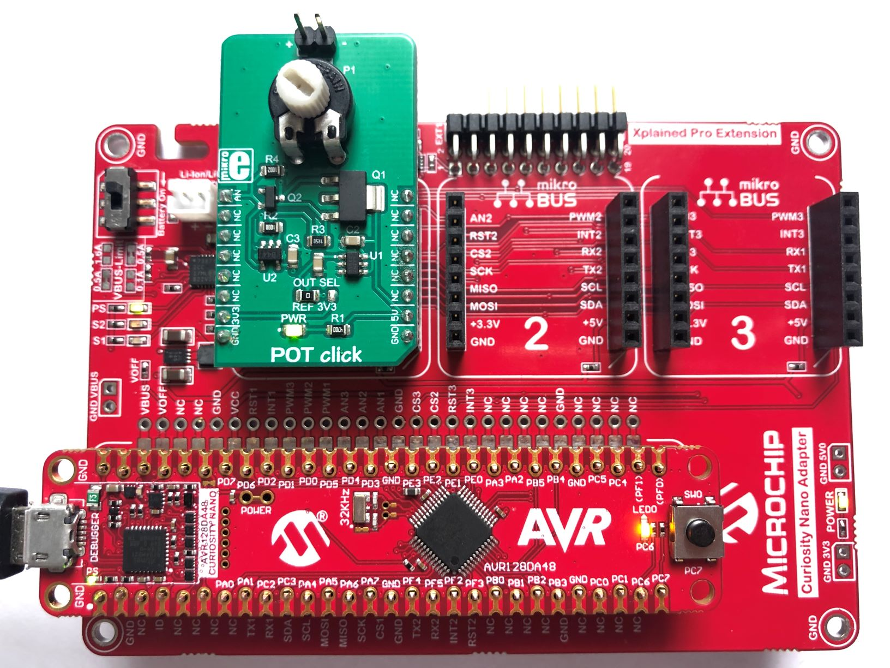

 The following configurations must be made for Hardware Configuration A:

|Pin           | Configuration      |
| :----------: | :----------------: |
|PD3 (AIN3)    | Analog Input       |
|PC6 (LED0)    | Digital Output     |

  - **The Hardware Configuration B** uses two POT clicks, inserted in mikroBUS slot 1 and slot 2. Slot 1
connects AN1 to the PD3 (AIN3) and slot 2 connects AN2 to PD4 (AIN4) pin of the AVR® DA microcontroller.
 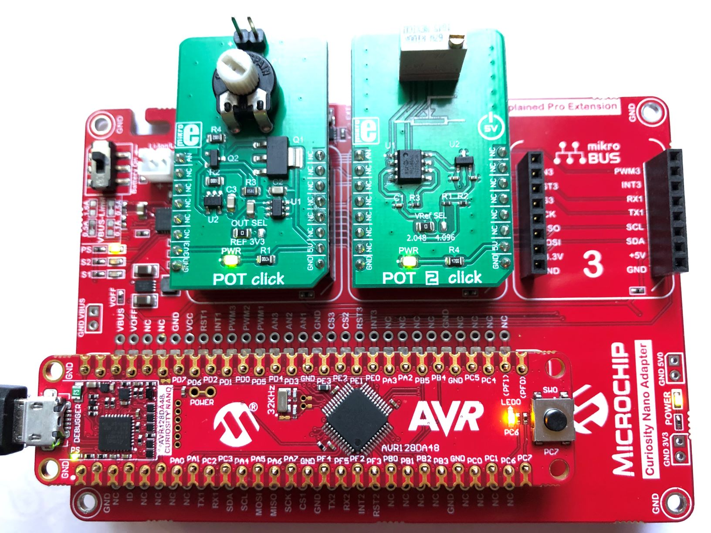

 The following configurations must be made for Hardware Configuration B:

|Pin           | Configuration      |
| :----------: | :----------------: |
|PD3 (AIN3)    | Analog Input       |
|PD4 (AIN4)    | Analog Input       |
|PC6 (LED0)    | Digital Output     |

## Operation

### ADC Differential Conversion
This example will initialize the ADC, configure two pins for reading the differential voltage, start the conversion and read the ADC result in an infinite loop.

**The Hardware <a href="#ConfigB">Configuration B</a> will be used for this example**
1. Connect the board to the PC.
2. Open the *AVRDA_ADC_Examples.atsln* solution in Atmel Studio
3. Set *ADC_Differential_Conversion* project as StartUp project:
 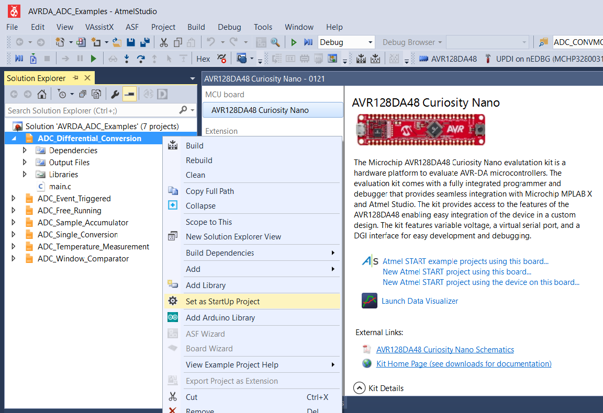
4. Build the *ADC_Differential_Conversion* project: right click on *ADC_Differential_Conversion* and select Build
 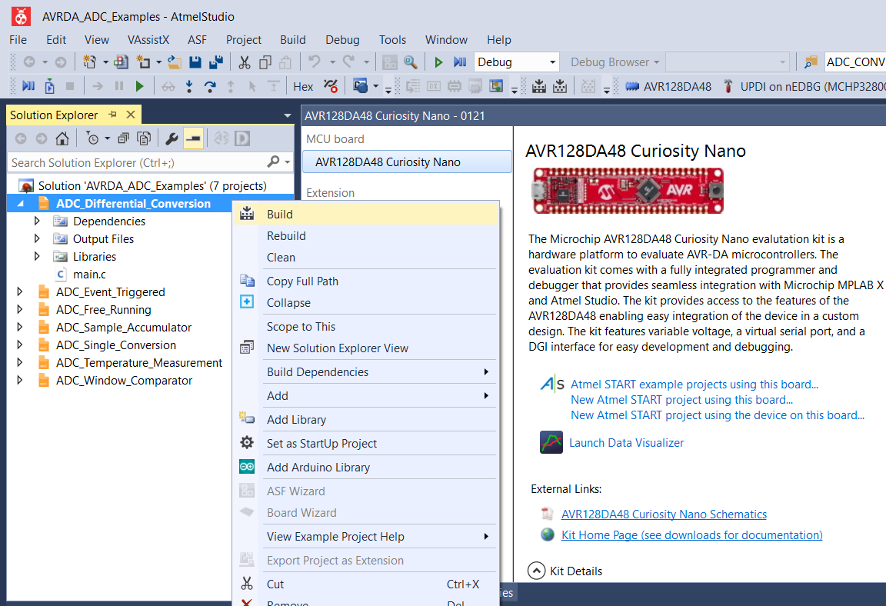
5. Select the AVR128DA48 Curiosity Nano on-board debugger in the *Tool* section of the *AVR-Dx_Bootloader* project settings:
 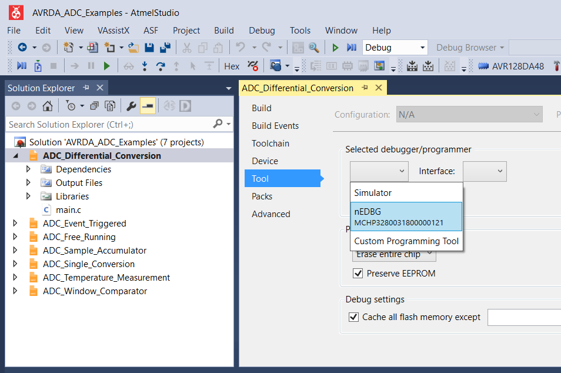
   - Right click on the project and click *Properties*;
   - Click *Tool* tab on the left panel, select the corresponding debugger and save the configuration (Ctrl + S)
6. Select Debug → Start Debugging and Break (Alt+F5)
 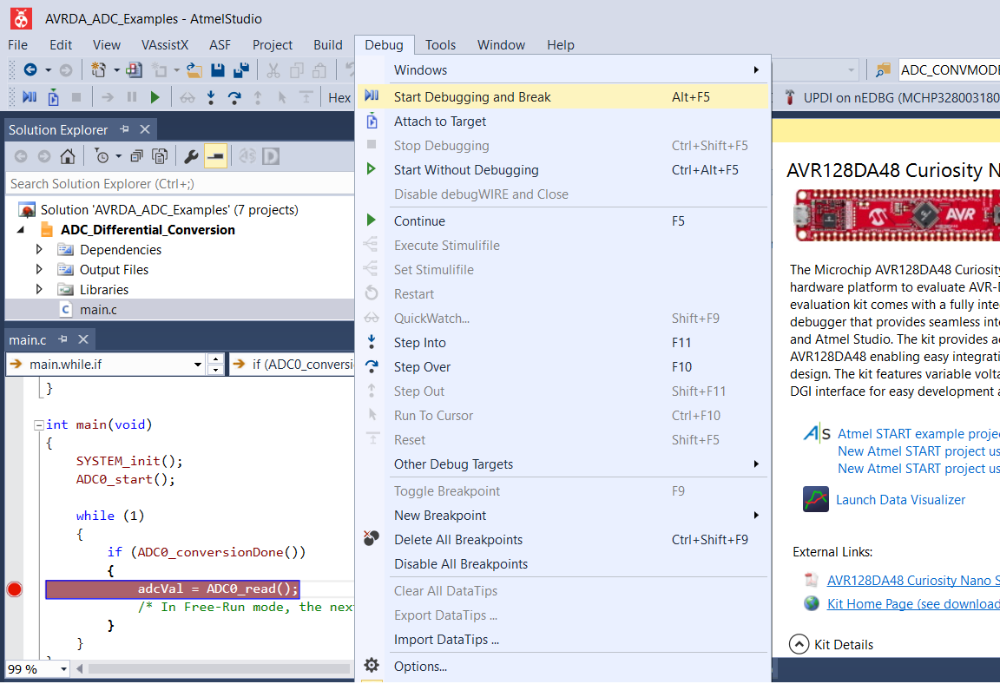
   - Add a brake point on `adcVal` in the main function
7. Result: Rotating the Potentiometers on the POT click boards (while pressing F5 key), the adcVal result will vary from a positive to a negative value:
 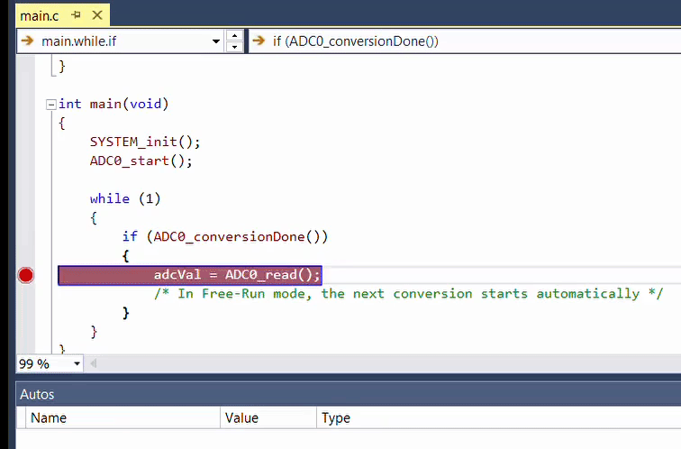

### ADC Event Triggered
This example will initialize the ADC and Real-Time Counter (RTC), configure the Event System (EVSYS) to trigger an
ADC conversion on the RTC overflow; an LED is toggled on after each ADC conversion.

**The Hardware <a href="#ConfigA">Configuration A</a> will be used for this example**
1. Connect the board to the PC.
2. Open the *AVRDA_ADC_Examples.atsln* solution in Atmel Studio
3. Set *ADC_Event_Triggered* project as StartUp project
4. Right click on *ADC_Event_Triggered* and select Build
5. Select the AVR128DA48 Curiosity Nano on-board debugger in the *Tool* section of the *AVR-Dx_Bootloader* project settings:
   - Right click on the project and click *Properties*;
   - Click *Tool* tab on the left panel, select the corresponding debugger and save the configuration (Ctrl + S)
6. Result: The LED0 will toggle with a frequency of `RTC_PERIOD`, that can be modified
 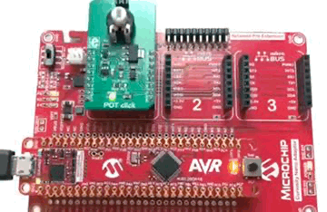

### ADC Free Running
This example will Initialize the ADC, enable Free Running mode, start the conversion and read the ADC result in an infinite loop.

**The Hardware <a href="#ConfigA">Configuration A</a> will be used for this example**
1. Connect the board to the PC.
2. Open the *AVRDA_ADC_Examples.atsln* solution in Atmel Studio
3. Set *ADC_Free_Running* project as StartUp project
4. Right click on *ADC_Free_Running* and select Build
5. Select the AVR128DA48 Curiosity Nano on-board debugger in the *Tool* section of the *AVR-Dx_Bootloader* project settings:
   - Right click on the project and click *Properties*;
   - Click *Tool* tab on the left panel, select the corresponding debugger and save the configuration (Ctrl + S)
6. Select Debug → Start Debugging and Break (Alt+F5)
   - Add a brake point on `adcVal` in the main function
7. Result: Rotating the Potentiometer on the POT click board (while pressing F5 key ), the adcVal result will vary:
 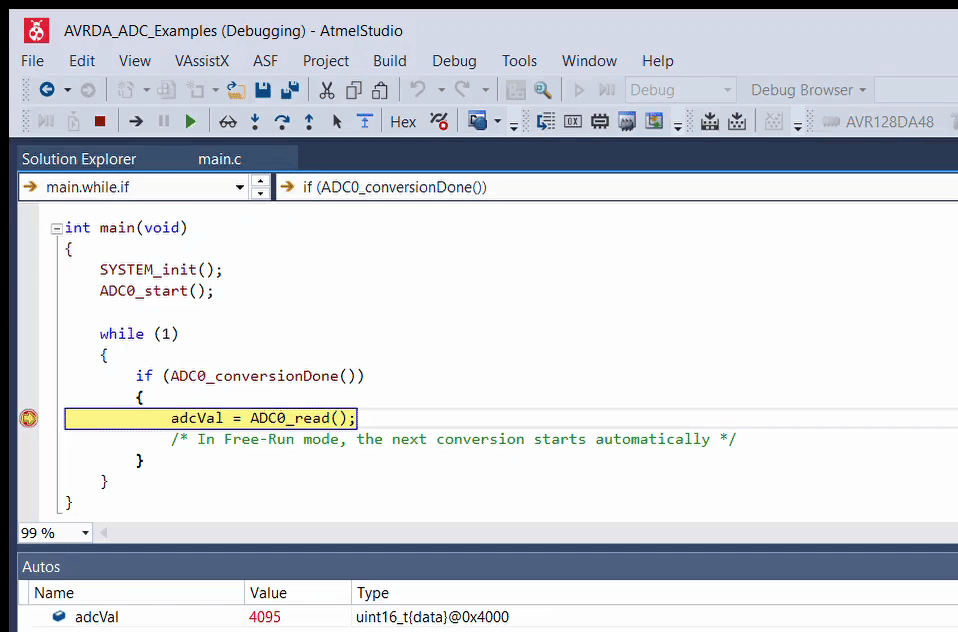

### ADC Sample Accumulator
This example will Initialize the ADC, enable accumulation of 64 samples, start the conversion and read the ADC result in a loop.

**The Hardware <a href="#ConfigA">Configuration A</a> will be used for this example**
1. Connect the board to the PC.
2. Open the *AVRDA_ADC_Examples.atsln* solution in Atmel Studio
3. Set *ADC_Sample_Accumulator* project as StartUp project
4. Right click on *ADC_Sample_Accumulator* and select Build
5. Select the AVR128DA48 Curiosity Nano on-board debugger in the *Tool* section of the *AVR-Dx_Bootloader* project settings:
   - Right click on the project and click *Properties*;
   - Click *Tool* tab on the left panel, select the corresponding debugger and save the configuration (Ctrl + S)
6. Select Debug → Start Debugging and Break (Alt+F5)
   - Add a brake point on `adcVal` in the main function
7. Result: Rotating the Potentiometer on the POT click board (while pressing F5 key), the adcVal result will vary:
 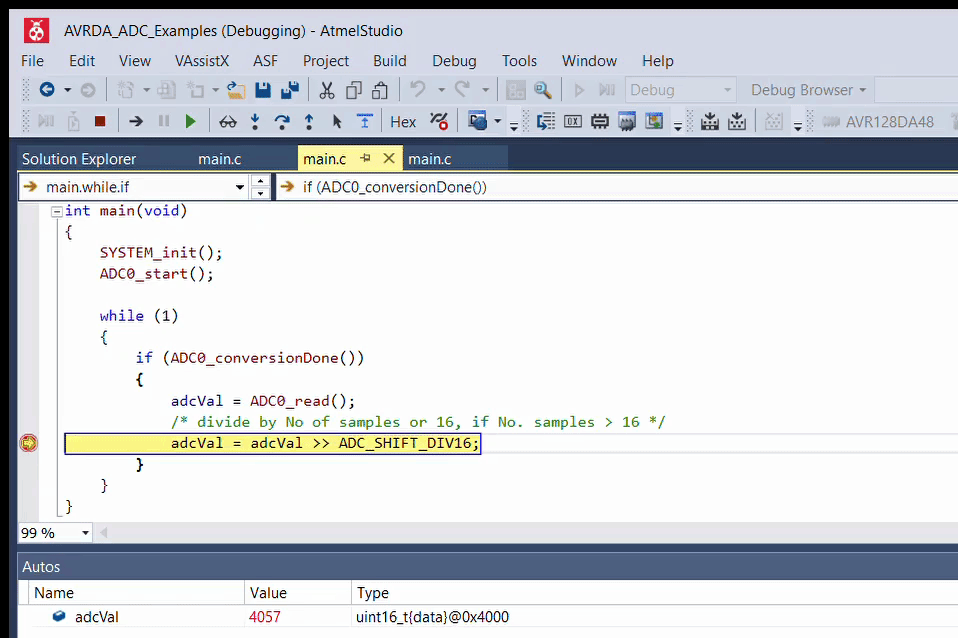

### ADC Single Conversion
This example will initialize the ADC, start the conversion and wait until it is completed, and read ADC result in a loop.

**The Hardware <a href="#ConfigA">Configuration A</a> will be used for this example**
1. Connect the board to the PC.
2. Open the *AVRDA_ADC_Examples.atsln* solution in Atmel Studio
3. Set *ADC_Single_Conversion* project as StartUp project
4. Right click on *ADC_Single_Conversion* and select Build
5. Select the AVR128DA48 Curiosity Nano on-board debugger in the *Tool* section of the *AVR-Dx_Bootloader* project settings:
   - Right click on the project and click *Properties*;
   - Click *Tool* tab on the left panel, select the corresponding debugger and save the configuration (Ctrl + S)
6. Select Debug → Start Debugging and Break (Alt+F5)
   - Add a brake point on `adcVal` in the main function
7. Result: Rotating the Potentiometer on the POT click board (while pressing F5 key), the adcVal result will vary:
 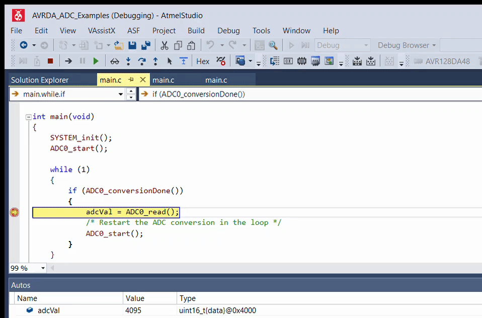

### ADC Temperature Measurement
This example will initialize the ADC, select the temperature sensor as input and acquire the data by running a 12-bit, right adjusted, single-ended conversion.

**The Hardware <a href="#ConfigA">Configuration A</a> will be used for this example**
1. Connect the board to the PC.
2. Open the *AVRDA_ADC_Examples.atsln* solution in Atmel Studio
3. Set *ADC_Temperature_Measurement* project as StartUp project
4. Right click on *ADC_Temperature_Measurement* and select Build
5. Select the AVR128DA48 Curiosity Nano on-board debugger in the *Tool* section of the *AVR-Dx_Bootloader* project settings:
   - Right click on the project and click *Properties*;
   - Click *Tool* tab on the left panel, select the corresponding debugger and save the configuration (Ctrl + S)
6. Select Debug → Start Debugging and Break (Alt+F5)
   - Add a brake point on `temp_C` in the main function
7. Result: Pressing the F5 key, the `temp_C` Value will show the ambient temperature in Celsius (25°C):
 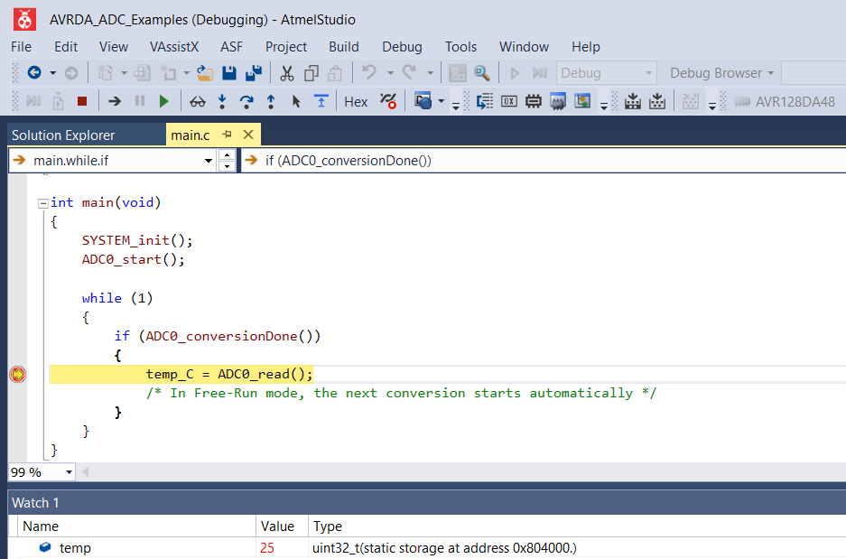

### ADC Window Comparator
This example will set the conversion window comparator low threshold, enable the conversion Window mode,
enable the Free Running mode, start the conversion and wait until it is completed, read the ADC result in an
infinite loop, an LED is toggled on if the ADC result is below the set threshold.

**The Hardware <a href="#ConfigA">Configuration A</a> will be used for this example**
1. Connect the board to the PC.
2. Open the *AVRDA_ADC_Examples.atsln* solution in Atmel Studio
3. Set *ADC_Window_Comparator* project as StartUp project
4. Right click on *ADC_Window_Comparator* and select Build
5. Select the AVR128DA48 Curiosity Nano on-board debugger in the *Tool* section of the *AVR-Dx_Bootloader* project settings:
   - Right click on the project and click *Properties*;
   - Click *Tool* tab on the left panel, select the corresponding debugger and save the configuration (Ctrl + S)
6. Result: Rotating the Potentiometer on the POT click board will modify the adcVal untill LED0 will turn off:
 

## Summary
The [*TB3245 - Using 12-Bit ADC for Conversions, Accumulation, and Triggering Events](http://www.microchip.com/wwwappnotes/appnotes.aspx?appnote=en1001530) document provides <a href="#UseCases">seven use cases</a> for using the 12-bit ADC of The AVR® DA family of microcontrollers.
=======

## Setup for Use Case #1
**Free-Running to External I/O**

The AVR128DA48 Curiosity Nano Development Board is used as test platform.
 

 The following configurations must be made for this project:

 ZCD:
 - Enable the ZCD
 - Enable the output of the ZCD

|Pin           | Configuration                               |
| :----------: | :-----------------------------------------: |
|PA7           | Digital Output                              |
|PD1           | Interrupt and digital input buffer disabled |

## Operation for Use Case #1
**Free-Running to External I/O**
1. Connect the board to the PC.

2. Open the *ZCD_EXAMPLES.atsln* solution in Atmel Studio

3. Set *ZCD_FreeRunning* project as StartUp project:
 

4. Build the *ZCD_FreeRunning* project: right click on *ZCD_FreeRunning* and select Build
 

5. Select the AVR128DA48 Curiosity Nano on-board debugger in the *Tool* section of the *ZCD_FreeRunning* project settings:
  - Right click on the project and click *Properties*;
  - Click *Tool* tab on the left panel, select the corresponding debugger and save the configuration (Ctrl + S)
 

6. Program *ZCD_FreeRunning* project to the board: select *ZCD_FreeRunning* project and click *Start Without Debugging*:
 

 **Results**
 ZCD_OUT is represented by Channel 1 (orange) in the screenshot below
 ZCD_IN is represented by Channel 3 (blue) in the screenshot below
 

## Setup for Use Case #2
**AC Signal Frequency Detection**

 The following configurations must be made for this project:

 Clock:
 - OSCHF as main clock source
 - OSCHF frequency set to 4 MHz

 TCB0:
 - Input Capture Frequency
 - Event Input Enable: enabled
 - Capture or Timeout: enabled
 - CLK_PER/2 (From Prescaler)
 - TCB enabled
 - Run Standby: enabled

 EVSYS:
 - Zero-cross detector 0 out linked to Event Channel 0
 - TCB uses Event Channel 0

 ZCD:
 - Enable the ZCD
 - Enable the output of the ZCD

|Pin           | Configuration                               |
| :----------: | :-----------------------------------------: |
|PA7           | Digital Output                              |
|PD1           | Interrupt and digital input buffer disabled |

## Operation for Use Case #2
**AC Signal Frequency Detection**

1. Set *ZCD_FrequencyDetection* project as StartUp project:
 

2. Build the *ZCD_FrequencyDetection* project: right click on *ZCD_FrequencyDetection* and select Build
 

3. Select the AVR128DA48 Curiosity Nano on-board debugger in the *Tool* section of the *ZCD_FrequencyDetection* project settings:
  - Right click on the project and click *Properties*;
  - Click *Tool* tab on the left panel, select the corresponding debugger and save the configuration (Ctrl + S)
 

4. Program *ZCD_FrequencyDetection* project to the board: select *ZCD_FrequencyDetection* project and click *Start Without Debugging*:
 

## Setup for Use Case #3
**Active Bridge Control Signal Generation**

 The following configurations must be made for this project:

 Clock:
 - OSCHF as main clock source
 - OSCHF frequency set to 4 MHz

 EVSYS:
 - Zero-cross detector 0 out linked to Event Channel 0
 - Event system output B (PB2) uses Event Channel 0
 - Zero-cross detector 1 out linked to Event Channel 1
 - Event system output C (PC2) uses Event Channel 1

 ZCD0:
 - Enable the ZCD0

  ZCD1:
  - Enable the ZCD1
  - Invert the ZCD1 OUTPUT

|Pin           | Configuration                               |
| :----------: | :-----------------------------------------: |
|PD1           | Interrupt and digital input buffer disabled |
|PE3           | Interrupt and digital input buffer disabled |
|PB2           | Digital Output                              |
|PC2           | Digital Output                              |

## Operation for Use Case #3
**Active Bridge Control Signal Generation**

1. Set *ZCD_ActiveBridge* project as StartUp project:
 

2. Build the *ZCD_ActiveBridge* project: right click on *ZCD_ActiveBridge* and select Build
 

3. Select the AVR128DA48 Curiosity Nano on-board debugger in the *Tool* section of the *ZCD_ActiveBridge* project settings:
  - Right click on the project and click *Properties*;
  - Click *Tool* tab on the left panel, select the corresponding debugger and save the configuration (Ctrl + S)
 

4. Program *ZCD_ActiveBridge* project to the board: select *ZCD_ActiveBridge* project and click *Start Without Debugging*:
 

 **Results**
 Driving Signals for the Active Bridge Implementation
 

## Summary
The [*TB3233 - Using ZCD to Implement Special Functions*](https://www.microchip.com/wwwappnotes/appnotes.aspx?appnote=en1001524) document provides three use cases for ZCD usage in combinations with other peripherals in various application scenarios.
>>>>>>> 2a94f39f2184bd455ed1eb511b7256f7d49f3d04
